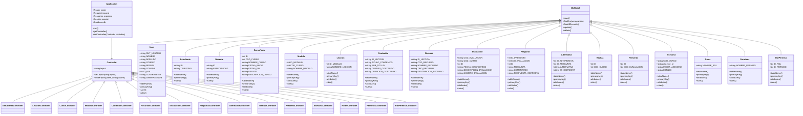

```mermaid
classDiagram
    class Application {
        +Router router
        +Request request
        +Response response
        +Session session
        +Database db
        +run()
        +getController()
        +setController(Controller controller)
    }
    class Controller {
        +string layout
        +setLayout(string layout)
        +render(string view, array params)
    }
    class DbModel {
        +save()
        +findOne(array where)
        +findAllRecords()
        +update()
        +delete()
    }
    class User {
        +string RUT_USUARIO
        +string NOMBRE
        +string APELLIDO
        +string CORREO
        +string REGION
        +string COMUNA
        +int ID_ROL
        +string CONTRASENIA
        +string confirmPassword
        +tableName()
        +primaryKey()
        +save()
        +rules()
    }
    class Estudiante {
        +string ID
        +string TELEFONO
        +tableName()
        +primaryKey()
        +rules()
    }
    class Docente {
        +string ID
        +string ESPECIALIDAD
        +tableName()
        +primaryKey()
        +rules()
    }
    class CursoForm {
        +int ID
        +int COD_CURSO
        +string NOMBRE_CURSO
        +string FECHA_INICIO
        +string FECHA_FIN
        +string ESTADO
        +string DESCRIPCION_CURSO
        +tableName()
        +primaryKey()
        +attributes()
        +rules()
    }
    class Modulo {
        +int ID_MODULO
        +int COD_CURSO
        +string NOMBRE_MODULO
        +tableName()
        +primaryKey()
        +attributes()
        +rules()
    }
    class Leccion {
        +int ID_MODULO
        +string NOMBRE_LECCION
        +tableName()
        +primaryKey()
        +attributes()
        +rules()
    }
    class Contenido {
        +string ID_LECCION
        +string TITULO_CONTENIDO
        +string SUB_TITULO
        +string CUERPO_CONTENIDO
        +string CREACION_CONTENIDO
        +tableName()
        +primaryKey()
        +attributes()
        +rules()
    }
    class Recurso {
        +string ID_LECCION
        +string COD_RECURSO
        +string NOMBRE_RECURSO
        +string TIPO_RECURSO
        +string DESCRIPCION_RECURSO
        +tableName()
        +primaryKey()
        +attributes()
        +rules()
    }
    class Evaluacion {
        +string COD_EVALUACION
        +string COD_CURSO
        +int ID
        +string FECHA_DIAGNOSTICO
        +string DESCRIPCION_EVALUACION
        +string NOMBRE_EVALUACION
        +tableName()
        +primaryKey()
        +attributes()
        +rules()
    }
    class Pregunta {
        +int ID_PREGUNTA
        +int COD_EVALUACION
        +int ID
        +string PREGUNTA
        +string COMENTARIO
        +string RESPUESTA_CORRECTA
        +tableName()
        +primaryKey()
        +attributes()
        +rules()
    }
    class Alternativa {
        +int ID_ALTERNATIVA
        +int ID_PREGUNTA
        +string ALTERNATIVA
        +string ES_CORRECTA
        +tableName()
        +primaryKey()
        +attributes()
        +rules()
    }
    class Realiza {
        +int ID
        +int COD_CURSO
        +tableName()
        +primaryKey()
        +attributes()
        +rules()
    }
    class Presenta {
        +int ID
        +int COD_EVALUACION
        +tableName()
        +primaryKey()
        +attributes()
        +rules()
    }
    class Asesoria {
        +string COD_CURSO
        +string docente_id
        +string FECHA_ASESORIA
        +string ESTADO
        +tableName()
        +primaryKey()
        +attributes()
        +rules()
    }
    class Roles {
        +string NOMBRE_ROL
        +tableName()
        +primaryKey()
        +attributes()
        +rules()
    }
    class Permisos {
        +string NOMBRE_PERMISO
        +tableName()
        +primaryKey()
        +attributes()
        +rules()
    }
    class RolPermiso {
        +int ID_ROL
        +int ID_PERMISO
        +tableName()
        +primaryKey()
        +attributes()
        +rules()
    }

    Application --> Controller
    Controller <|-- EstudianteController
    Controller <|-- LeccionController
    Controller <|-- CursoController
    Controller <|-- ModuloController
    Controller <|-- ContenidoController
    Controller <|-- RecursosController
    Controller <|-- EvaluacionController
    Controller <|-- PreguntasController
    Controller <|-- AlternativaController
    Controller <|-- RealizaController
    Controller <|-- PresentaController
    Controller <|-- AsesoriaController
    Controller <|-- RolesController
    Controller <|-- PermisosController
    Controller <|-- RolPermisoController
    DbModel <|-- User
    DbModel <|-- Estudiante
    DbModel <|-- Docente
    DbModel <|-- CursoForm
    DbModel <|-- Modulo
    DbModel <|-- Leccion
    DbModel <|-- Contenido
    DbModel <|-- Recurso
    DbModel <|-- Evaluacion
    DbModel <|-- Pregunta
    DbModel <|-- Alternativa
    DbModel <|-- Realiza
    DbModel <|-- Presenta
    DbModel <|-- Asesoria
    DbModel <|-- Roles
    DbModel <|-- Permisos
    DbModel <|-- RolPermiso
```